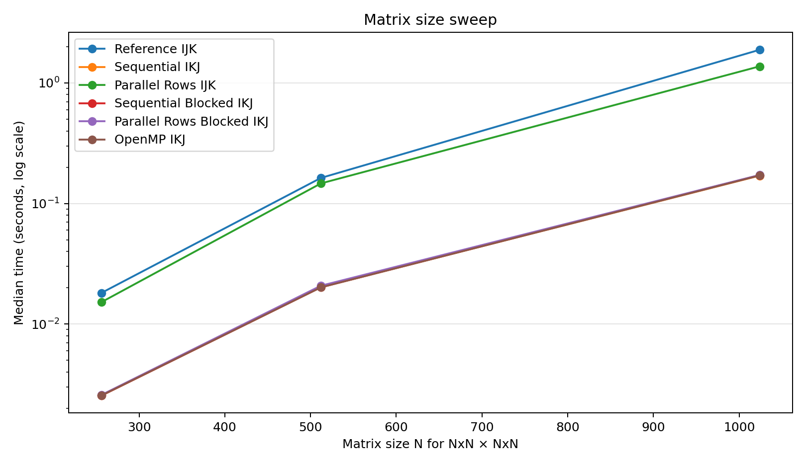
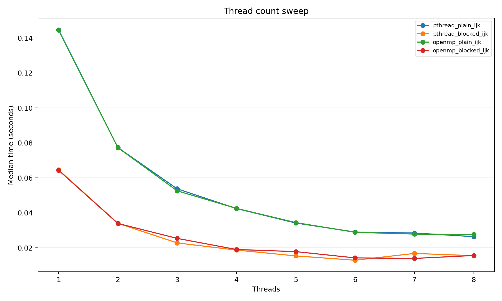
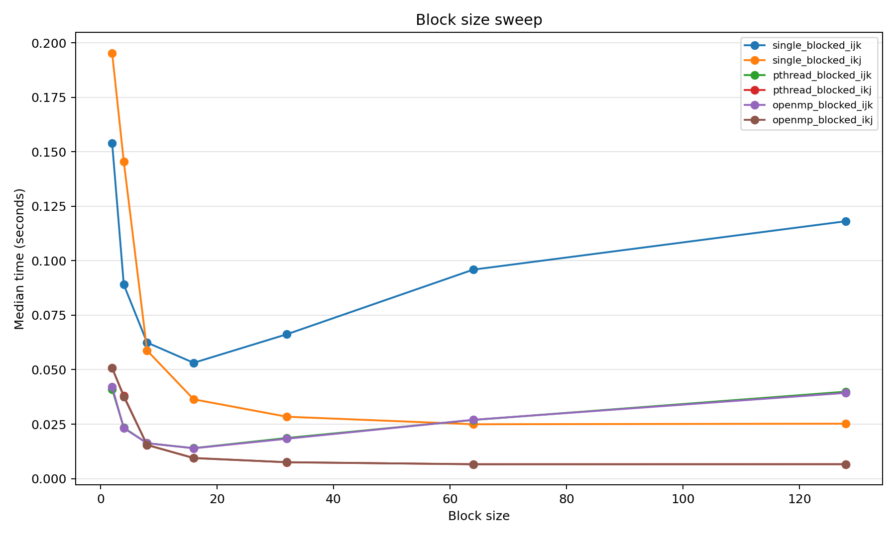

# tinykernels

`tinykernels` is a small C project for learning how matrix multiplication kernels work on the CPU.

It includes a naive baseline, loop-order variants, blocking, pthread parallelism, optional OpenMP, correctness tests, CSV benchmarks, and a plotting script.

## Build

```bash
make
```

Run correctness tests:

```bash
make test
```

Run benchmarks and regenerate plots:

```bash
make bench
```

Build with sanitizers:

```bash
make sanitize
./tinykernels test
```

OpenMP is disabled by default so the project builds with the default macOS compiler. Enable it when your compiler supports OpenMP:

```bash
make OPENMP=1
```

On macOS with Homebrew LLVM:

```bash
make LLVM_PREFIX=/opt/homebrew/opt/llvm OPENMP=1
```

## CLI

```bash
./tinykernels test   # correctness tests
./tinykernels bench  # benchmark suite
./tinykernels all    # tests, then benchmarks
```

Running `./tinykernels` with no arguments defaults to `test`.

## API

```c
MatmulConfig cfg = matmul_config(
    MATMUL_BACKEND_PTHREAD,
    MATMUL_LOOP_IKJ,
    1,   // use blocking
    4,   // threads
    32   // block size
);

Matrix c = matmul(&a, &b, cfg);
```

Use `matmul_into()` when you already own the output buffer, especially for benchmarks:

```c
int ok = matmul_into(&a, &b, &c, cfg);
```

## Project Layout

```text
include/              public headers
src/matmul/           matmul dispatch and backends
src/test.c            correctness tests
src/bench.c           benchmark suite
scripts/              benchmark plotting
assets/               generated plots
```

## Benchmarks

`make bench` writes `benchmark_results.csv` and refreshes these plots:







CSV columns:

```text
sweep,rows,inner,cols,backend,loop_order,use_blocking,num_threads,block_size,iterations,time_sec,speedup_vs_baseline,label
```

## Roadmap

- Add quick/full benchmark options.
- Add SIMD experiments.
- Add CUDA experiments.
