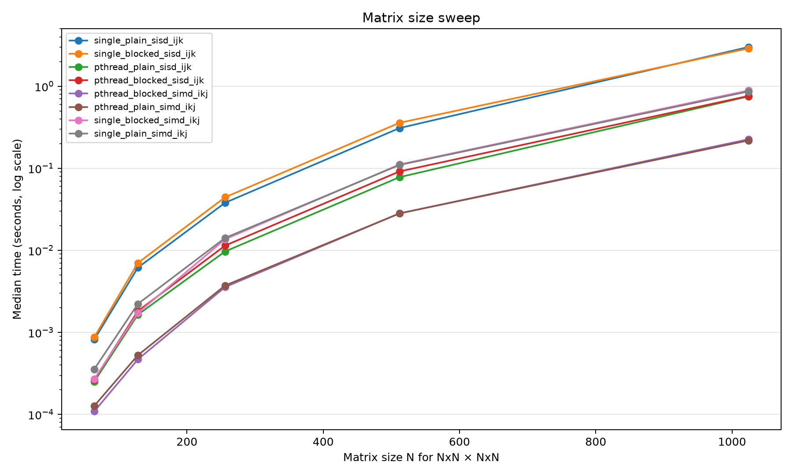
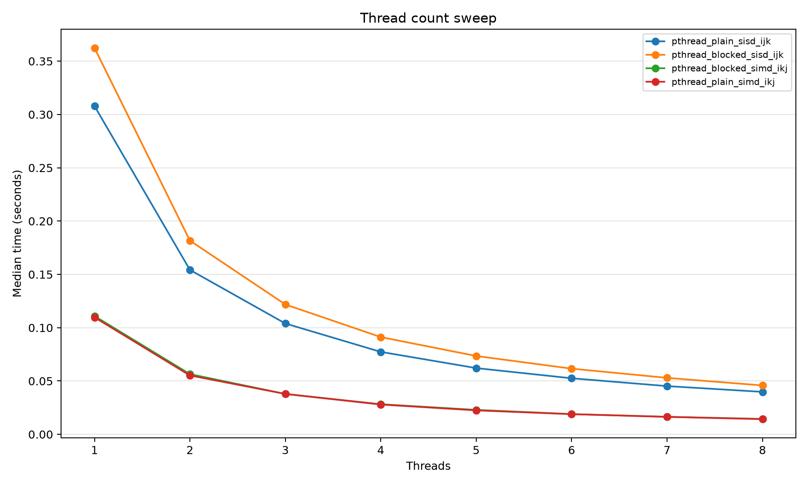
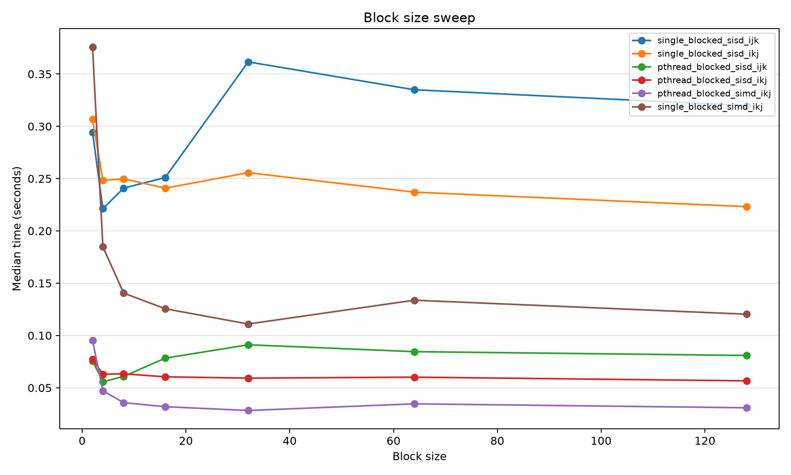

# tinykernels

`tinykernels` is a small C project for learning how matrix multiplication kernels work on the CPU.

It includes a naive baseline, loop-order variants, blocking, SIMD IKJ kernels, pthread parallelism, optional OpenMP, correctness tests, CSV benchmarks, and a plotting script.

## Build

```bash
make
```

Run correctness tests:

```bash
make test
```

Run benchmarks and regenerate plots:

```bash
make bench
```

Build with sanitizers:

```bash
make sanitize
./tinykernels test
```

OpenMP is disabled by default. Enable it when your compiler supports OpenMP:

```bash
make OPENMP=1
```


SIMD kernels are enabled automatically when the target supports x86 SSE. Unsupported SIMD requests are rejected instead of silently falling back to scalar code.

## CLI

```bash
./tinykernels test   # correctness tests
./tinykernels bench  # benchmark suite
./tinykernels all    # tests, then benchmarks
```

Running `./tinykernels` with no arguments defaults to `test`.

## API

```c
MatmulConfig cfg = matmul_config(
    MATMUL_BACKEND_PTHREAD,
    MATMUL_LOOP_IKJ,
    1,   // use blocking
    0,   // use SIMD
    4,   // threads
    32   // block size
);

Matrix c = matmul(&a, &b, cfg);
```

Use `matmul_into()` when you already own the output buffer, especially for benchmarks:

```c
int ok = matmul_into(&a, &b, &c, cfg);
```

## Project Layout

```text
include/              public headers
src/matmul/           matmul dispatch and backends
results/              benchmark data, CSV, and plots
scripts/              benchmark plotting
```

## Benchmarks

The following data is from an AMD Ryzen 7 9800X3D with NVIDIA GeForce RTX 5070 Ti, running Arch Linux.







CSV columns:

```text
sweep,rows,inner,cols,backend,loop_order,use_blocking,use_simd,num_threads,block_size,iterations,time_sec,speedup_vs_baseline,label
```
